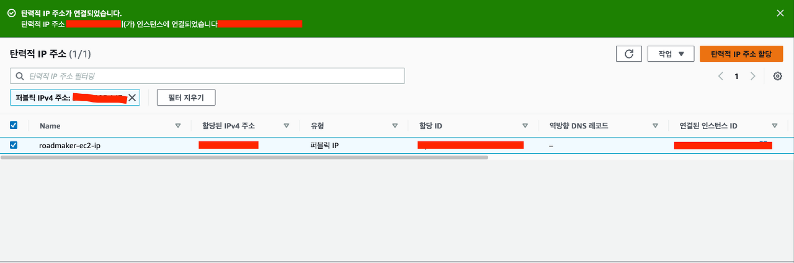

# Elastic IP

Elastic IP는 고정적인 IP 주소를 할당하고, 이를 인스턴스나 네트워크 인터페이스에 연결할 수 있는 서비스다.

EC2 인스턴스의 Public IP는 인스턴스를 중지하고 다시 실행하면 주소가 변경된다. 이로 인해 EC2의 Public IP를 DNS나 다른 서비스의 화이트리스트로 등록했을 경우, IP 주소 변경으로 인해 여러 문제가 발생할 수 있다.

따라서 Elastic IP에서 고정적인 IP 주소를 할당하고, 이를 EC2에 연결해주는 것이다. 이렇게 하면 IP 주소 변경으로 인한 문제를 해결 할 수 있다.

다음은 '탄력적 IP 주소 할당'을 눌러 IP를 생성하고 이를 EC2에 연결했을 때 나오는 화면이다.

참고로 Elastic IP의 경우 사용하고 있을 때는 요금이 발생하지 않지만, 인스턴스가 중지되어 사용하고 있지 않을 때 비용이 발생된다.

따라서 더 이상 사용하지 않을 IP 주소가 있다면 해제하여 우리의 통장을 지켜주도록 하자.
