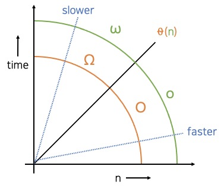

# 복잡성

## 복잡성 소개

시간 복잡도는 서로 다른 알고리즘의 효율성을 비교할 때 사용한다. 시간 복잡도에는 몇 가지 규칙이 있다.

1. **입력값(n)은 항상 0보다 크다**:
   - 입력 데이터의 크기나 개수는 음수일 수는 없다. 그래서 복잡도는 항상 0보다 크다고 가정하고 계산해야 한다.
2. **함수는 많은 입력값이 있을 때 더 많은 작업을 하게 된다**:
   - 더 많은 입력값이 주어지면 어떤 작업을 하는 데 필요한 계산이나 처리 시간이 길어진다.
3. 시간 복잡도에서는 모든 상수를 삭제한다:
   - 2n, 3n, 50n 모두 복잡도가 n인 알고리즘이다.
4. **낮은 차수의 항들은 무시한다**:
   - n3 + n2 + n 이라는 함수가 있을 때 n과 n2은 시간 복잡도에 영향을 미치지 않는다. 입력값이 무한이 될 때 고려해야 할 부부은 n3이다.
5. **시간 복잡도 함수가 log 함수를 포함할 경우 밑은 무시한다**:
   - 모든 로그는 서로 배수 관계이다. 그래서 복잡도에 관해 이야기할 때 로그의 밑에 대해서는 고려하지 않아도 된다. 로그의 밑은 무시하고 logn 알고리즘이라고 하면 된다.
   - 복잡도가 log인 알고리즘은 보통 무언가를 반으로 나누거나 2를 곱한 경우 자주 사용된다. 반으로 나누거나 2를 곱할 때 복잡도는 밑이 2인 로그가 된다. 10으로 나누거나 10으로 곱하면 밑이 10인 로그가 된다. 허나 밑은 무시하기에 모두 같은 로그 알고리즘이다.
6. **등호를 사용하여 표현한다**:
   - 2n은 O(n)과 같다. 여기서 O(n)은 2n이 어떤 함수의 집합에 속한다는 의미를 갖는다. 그렇기에 아래와 같은 등호를 활용하여 이 관계를 수학적으로 쓸 수 있다.
   - 2n ∈ O(n)

## 빅 오 표기법

빅 오 표기법은 알고리즘의 효율성을 표시하는 표기법이다. 빅 오 표기법을 사용하면 알고리즘끼리 비교하여 표현하는 것이 가능하다.

다른 알고리즘이 이 그래프의 어떤 위치에 있는지에 따라도 복잡도 n인 알고리즘과 다른 알고리즘의 복잡도를 비교할 수 있다.

빅 오 표기법에서는 이러한 알고리즘 간의 관계를 다음과 같이 표현한다.

- **O (빅 오 복잡도)** : 비교 대상인 다른 알고리즘과 같거나 더 빠르다.

- **θ (세타 복잡도)** : 비교 대상인 다른 알고리즘과 같다.

- **Ω (빅 오메가 복잡도)** : 비교 대상인 다른 알고리즘과 같거나 느리다.

- **o (리틀 오 복잡도)** : 비교 대상인 다른 알고리즘보다 더 빠르다.

- **ω (리틀 오메가 복잡도)** : 비교 대상인 다른 알고리즘과 느리다.

예를 들어 3n + n2 복잡도를 갖는 알고리즘이 있을 때 n2와 같거나 더 빠르기 때문에 O(n2)로 표기할 수 있다.

물론 세타 복잡도를 사용하여 θ(n2)로 표현할수도 있지만 일반적으로 빅 오 표기법을 사용한다.
