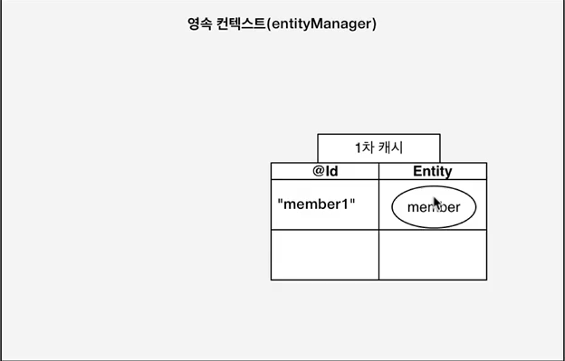
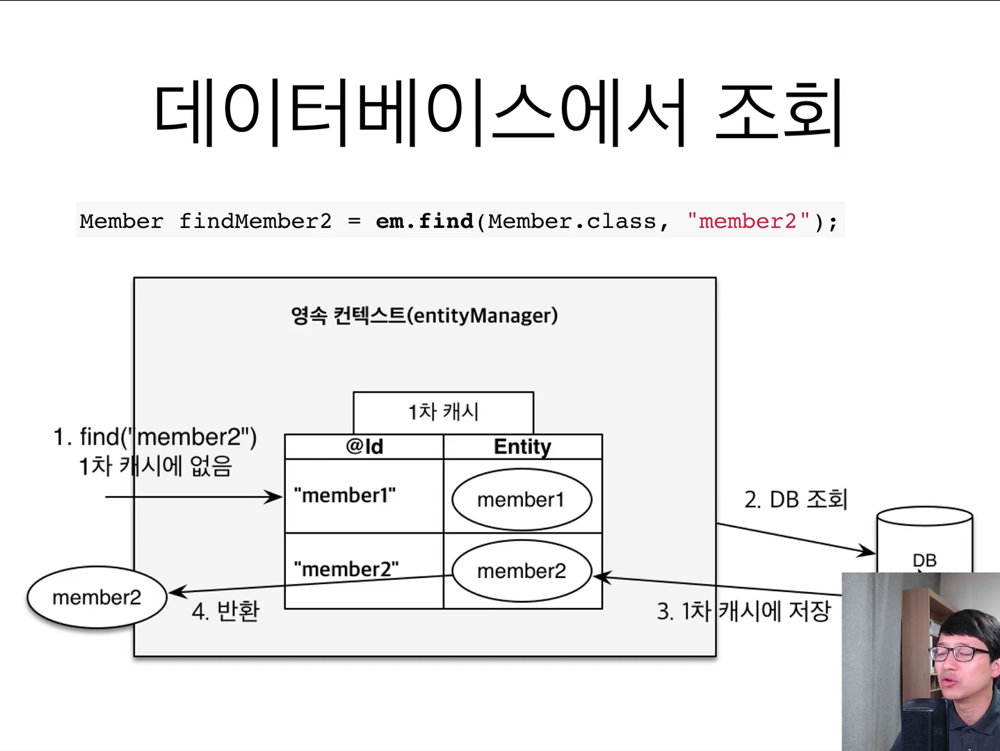
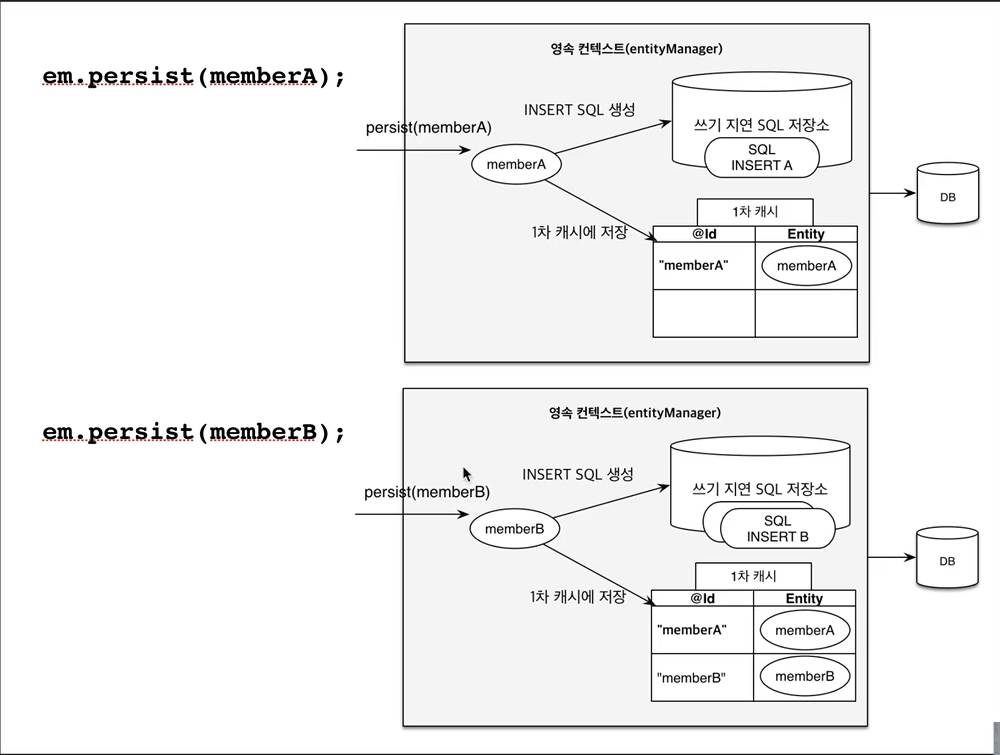
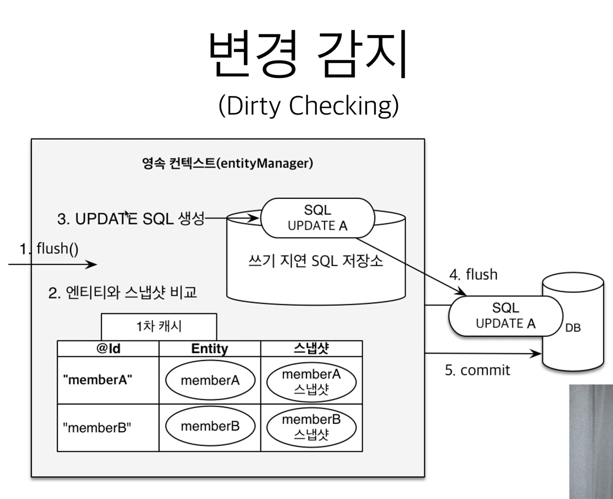
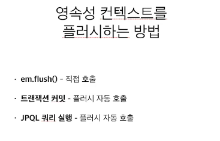
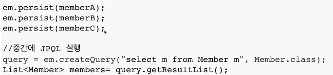
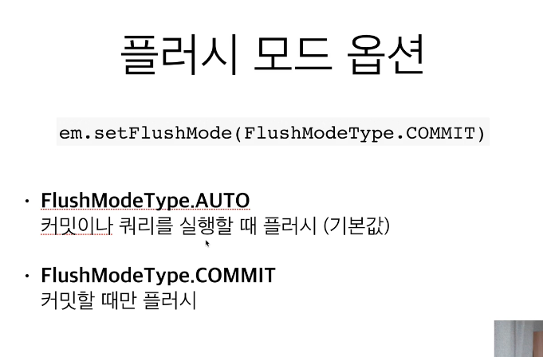
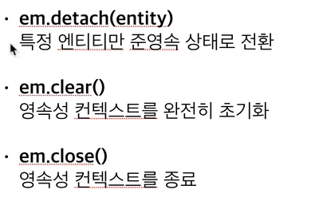

# 섹션3 영속성 관리 - 내부 동작 방식

## 영속성 컨텍스트 1

JPA에서 가장 중요 2가지

- 객체와 관계형 데이터베이스 매핑
- 영속성 컨텍스트

엔티티 매니저 팩토리와 엔티티 매니저

새로운 고객의 요청이 올 때마다 엔티티 매니저를 생성하고 엔티티 매니저는 내부적으로 db 커넥션을 사용해서 db에 접근

- JPA를 이해하는데 가장 중요한 용어: 영속성 컨텍스트
- "엔티티를 영구 저장하는 환경"이라는 뜻

### 엔티티 매니저? 영속성 컨텍스트?

- 영속성 컨텍스트는 논리적인 개념(눈에 보이지 않는다)
- 엔티티 매니저를 통해서 영속성 컨텍스트에 접근한다.

em을 생성하면 영속성 컨텍스트가 1:1

### 엔티티의 생명주기

- 비영속(new/transient): 영속성 컨텍스트와 전혀 관계가 없는 새로운 상태
- 영속(managed): 영속성 컨텍스트에 관리되는 상태
- 준영속(detached): 영속성 컨텍스트에 저장되었다가 분리된 상태
- 삭제(removed): 삭제된 상태

```java
// 객체를 생성한 상태(비영속)
Member member = new Member();
member.setId("100L");
member.setUsername("회원1");

EntityManger em = emf.createEntityManager();
em.getTransaction().begin();

// 객체를 저장한 상태(영속)
// 트랜잭션을 커밋할 때 db에 저장된다.
em.persist(member);
```

```java
em.detach(member); // 영속성 컨텍스트에서 분리
em.remove(member); // 삭제
```

### 영속성 컨텍스트의 이점

- 애플리케이션과 db사이의 중간 계층
- 1차 캐시
- 동일성 보장
- 트랜잭션을 지원하는 쓰기 지원(transactional write-behind)
- 변경 감지(Dirty Checking)
- 지연 로딩(Lazy Loading)

## 영속성 컨텍스트 2

### 엔티티 조회, 1차 캐시

영속 컨텍스트는 내부에 1차 캐시를 들고 있다.
em.persist(member);



em.find를 하면 먼저 1차 캐시를 탐색해서 조회한다.
1차 캐시에 없으면 db에서 조회한 후 1차 캐시에 저장하고 반환한다.



사실 큰 도움은 안된다.
em은 db 트랜잭션 단위로 만들고, 요청이 끝나면 트랜잭션을 지운다. 1차 캐시는 지워진다.
짧은 찰나의 순간에만 이득이 있기 떄문에 성능 이점은 크게 없다.

### 영속 엔티티의 동일성 보장

```java
Member findMember1 = em.find(Member.class, 101L); //1차 캐시에 entity가 없기에 db에서 가져온다.
Member findMember2 = em.find(Member.class, 101L); // 1차 캐시를 조회하기 떄문에 sql을 날리지 않는다.

System.out.println("result = " + (findMember1 == findMember2)); // 동일성 비교 true
```

### 엔티티 등록, 트랜잭션을 지원하는 쓰기 지연



영속 컨텍스트 안에는 쓰기 지연 SQL 저장소라는 것이 있다.
persist(member)가 호출되면 member를 1차 캐시에 저장한다.
그리고 엔티티를 분석해서 인서트 쿼리를 생성하고 쓰기 지연 SQL 저장소에 쌓아둔다.

persist(memberb)가 호출되면 또 insert query를 생성해서 쓰기 지연 SQL에 쌓아둔다.
커밋이 되는 시점에 flush가 되면서 commit 된다.

```java
EntityTransaction tx = em.getTransaction();
tx.begin();

Member member1 = new Member(150L, "A");
Member member2 = new Member(160L, "B");

// 모았다가 db에 한번에 보내기
em.persist(member1);
em.persist(member2);
System.out.println("==============");

tx.commit();
```

### 엔티티 수정 변경감지

> JPA는 값이 바뀌면 트랜잭션이 커밋하는 시점에 값을 변경한다.

JPA는 dirty checking이라는 기능으로 엔티티를 변경할 수 있다.
엔티티의 값을 바꾸려면 setter로 값을 바꾸고 쿼리를 날려야 할 것 같은데 변경만 해도 된다.

```java
Member member = em.find(Member.class, 150L);
member.setName("ZZZZ");
// em.persist(member); JPA를 잘 모르면 변경 사항을 저장해야 하는 것으로 생각하지만
// JPA는 자바 컬렉션처럼 db를 사용하는 것. 변경하면 변경된다.
```



1. db transaction을 commit 하면 내부적으로 flush()가 호출된다.
2. 1차 캐시안는 pk, entity, snap shot이 있다. snap shot은 영속 컨텍스트에 들어온 첫 상태. flush가 호출될 때 엔티티와 스냅샷을 비교한다. 업데이트 쿼리를 쓰기 지연 SQL 저장소에 올리고 반영한다.

### 엔티티 삭제

수정 감지와 같은 원리
한번에 삭제하는 것이 아니라 flush 될 때 삭제한다.

## 플러시

플러시: 영속성 컨텍스트의 변경 내용을 db에 반영하는 것
영속성 컨텍스트의 쿼리들을 db에 쭉 날리는 것.
transaction commit시 flush 발생

- 변경 감지
- 수정된 엔티티 쓰기 지연 SQL 저장소에 등록
- 쓰기 지연 SQL 저장소의 쿼리를 db에 전송(등록, 수정, 삭제 쿼리)



> 플러시를 해도 1차 캐시는 지워지지 않는다. 오직 쓰기 지연 SQL 저장소에 있는 쿼리들이 db에 반영이 되는 과정이다.

```java
Member member = new Member(200L, "member200");
em.persist(member);

em.flush(); // commit전까지 쿼리를 볼 수 없는데, 미리 보고 싶을 때 강제 호출

tx.commit();
```





### 플러시 정리

- 영속성 컨텍스트를 비우지 않음
- 영속성 컨텍스트의 변경내용을 데이터베이스에 동기화
- 트랜잭션이라는 작업 단위가 중요 -> 커밋 직전에만 동기화 하면 된다.

## 준영속 상태

- 영속 -> 준영속
- 영속 상태의 엔티티가 영속성 컨텍스트에서 분리(detached)
- 영속성 컨텍스트가 제공하는 기능을 사용 못함(더티 체킹)

### 준영속 상태로 만드는 방법



## 정리

### JPA에서 가장 중요한 2가지

- 객체와 관계형 데이터베이스 매핑하기
- 영속성 컨텍스트

### 영속성 컨텍스트

- 엔티티를 영구저장하는 환경
- 논리적인 개념
- em을 통해서 영속성 컨텍스트에 접근한다.
