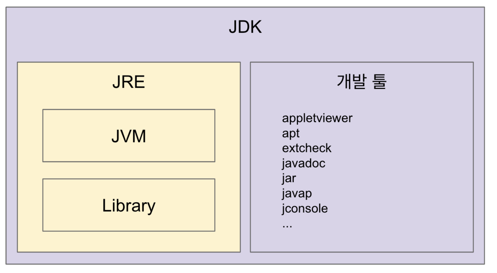

# Java vs JVM vs JRE vs JDK

자바에 대해 이야기 하다보면 Java, JVM, JDK, JRE을 정확히 구분하지 않고 혼동하는 경우가 있다.

오늘은 Java, JVM, JDK, JRE가 무엇이고 서로 어떻게 다른지 알아보자.

## Java

Java는 프로그래밍 언어 자체를 말한다. Java로 작성된 코드는 자바 컴파일러에 의해 바이트코드(.class 파일)로 컴파일되며 JVM 위에서 실행된다.

JVM은 바이트코드를 각 운영체제에 맞게 변환하고 실행하는 역할을 하는데, 이 덕분에 자바는 플랫폼에 독립적이다(어떤 운영체제에서 컴파일하더라도 모든 JVM이 있다면 모든 운영체제에서 실행 가능하다).

## JVM

JVM은 자바 가상 머신(Java Virtual Machine)의 약자로 자바 바이트 코드를 OS에 맞는 기계어로 변환하는 표준이자 구현체다.

표준이자 구현체라고 하는 이유는 JVM의 표준이 존재하고, 이 표준에 맞춰 Oracle이나 IBM 같은 곳에서 JVM을 구현하기 때문이다.

JVM 내부에는 인터프리터와 JIT 컴파일러가 존재하는데, 이것들이 바이트코드를 기계어로 변경한 후 실행한다.

JVM 덕분에 자바 바이트코드는 플랫폼에 독립적이지만, JVM은 운영체제에 종속적이다.

JVM은 JVM 홀로 제공되지 않는데, JRE와 JDK에 포함되어 제공된다.

_참고: JVM은 초기에 자바를 실행하기 위해 만들어졌으나, 자바 파일이나 자바 바이트코드를 생성할 수 있는 프로그래밍 언어라면 상관 없이 실행할 수 있다. 이것이 코틀린이 자바와 완벽 호환되는 이유다._

## JRE

JRE(Java Runtime Environment)는 자바 어플리케이션을 실행하기 위해 존재하며 JVM과 핵심 라이브러리가 들어있다.

오로지 실행을 위해 존재하기에 자바 컴파일러 같이 개발하는데 필요한 툴을 제공하진 않는다. 자바 컴파일러까지 같이 제공하는 것이 JDK다.

## JDK

JDK(Java Development Kit)는 앞서 이야기한 JVM, JRE와 자바 컴파일러, 디버거, 문서 생성 도구 등 자바로 개발하기 위한 모든 것들이 들어있다.

## 왜 Java, JVM, JDK, JRE를 구분해야 할까

간혹 오라클에 의해 자바가 유료화되기 때문에 코틀린을 써야 한다고 주장하는 사람이 있는데, 이는 자바에 대한 이해도가 부족한 발언이다.

오라클에 의해 유료화되는 것은 자바(프로그래밍 언어) 자체가 아니라 오라클이 개발한 Oracle JDK다. 자바를 사용해도 오픈소스인 Open JDK로 자바를 개발하고 실행한다면 무료이지만, 코틀린을 사용하더라도 Oracle JDK로 개발하고 실행하면 돈을 지불해야 한다.

이처럼 4가지 용어에 대해 명확히 구분할 수 있어야 언어나 기술 스택을 선택할 때 적합한 것을 선택할 수 있다.

## 참조

- [더 자바, 코드를 조작하는 다양한 방법, 백기선, 자바, JVM, JDK 그리고 JRE](https://www.inflearn.com/course/the-java-code-manipulation)
