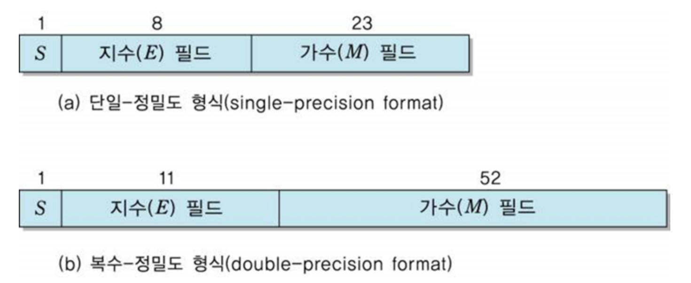

# float vs double

자바의 float과 double은 실수를 표현하는 기본 자료형이다. 그렇다면 이 자료형은 어떤 차이가 있을까? 먼저 결론은 다음과 같다.

1. **크기**:
   - **float**: 4바이트(32비트)
   - **double**: 8바이트(64비트)
2. **정밀도**:
   - **float**: 약 7자리의 정밀도
   - **double**: 약 15자리의 정밀도
3. **사용하는 경우**:
   - **float**: 메모리 제한이 부족한 상황. 예를 들어 임베디드 시스템에서 float을 사용하여 메모리를 절약할 수 있다.
   - **double**: 정밀한 계산이 필요한 애플리케이션. 일반적인 상황에서는 double을 사용하는 것이 좋다.

## IEEE 754

IEEE 754(아이 트리플 이 754라고 읽는다)는 IEEE(전기전자공학협회)에서 개발한 컴퓨터에서 부동소수점을 표현하는 가장 널리 쓰이는 표준이다. 자바의 경우 IEEE 754 표준에 따라 실수를 저장한다.

## 부동소수점

> 부동소수점(floating point) 방식은 실수를 컴퓨터상에서 근사하여 표현할 때 소수점의 위치를 고정하지 않고 그 위치를 나타내는 수를 따로 적는 것으로, 유효숫자를 나타내는 가수(假數)와 소수점의 위치를 풀이하는 지수(指數)로 나누어 표현한다.
>
> - 위키백과

IEEE 754 부동소수점 수는 세 부분으로 구성된다.

1. **부호 비트(Sign bit)**: 숫자의 부호를 나타낸다. 0은 양수, 1은 음수다.
2. **지수(Exponent)**: 부동소수점의 스케일을 조정하는데 사용된다.
3. **가수(Mantissa)**: 실제 숫자의 정보를 나타내며, 정규화된 형태로 저장된다.

float은 단일-정밀도 형식을 사용하고 double의 경우 복수-정밀도 형식을 사용한다.

## float vs double

실수를 이진수로 변환하거나, 부동 소수점으로 표현하는 과정에서 무한소수로 변환될 수 있다. 컴퓨터 메모리는 유한하기 때문에 무한소수를 전부 담지 못하고 일정 자리수에서 자르는데, 오차없이 표현할 수 있는 자리수를 정밀도(precision)이라고 한다.

float은 4바이트로 실수를 저장하고, double은 8바이트로 실수를 저장하기에 double은 약 15자리수의 정밀도를 갖고, float은 7자리의 정밀도를 갖는다. 즉 실수간의 연산 시 double이 float보다 오차 발생 가능성이 더 적다.

따라서 많은 경우 double을 사용하고, 메모리를 절약하고 쪼개서 사용하는 경우 float을 사용한다.

## 출처

- 자바의 신
- [위 수식이 틀린 이유는? (개발자 면접 타임)](https://youtu.be/-GsrYvZoAdA?feature=shared)
- [float vs double의 차이는?](https://github.com/wjdrbs96/Today-I-Learn/blob/master/Java/Data-Type/float%20vs%20double%20%EC%B0%A8%EC%9D%B4%EB%8A%94%3F.md)
- [IEEE 754 - 위키백과](https://ko.wikipedia.org/wiki/IEEE_754)
- [부동소수점 - 위키백과](https://ko.wikipedia.org/wiki/%EB%B6%80%EB%8F%99%EC%86%8C%EC%88%98%EC%A0%90)
