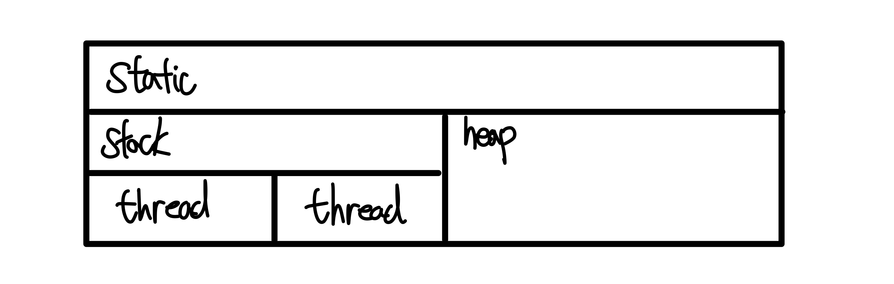

# 2장 자바와 절차적/구조적 프로그래밍

## 1. 학습 목표

자바의 변수가 메모리에 어떻게 저장되고 사용되는지, 메서드가 어떻게 호출되고 메모리에 어떤 변화를 일으키는지를 살펴보면서 객체 지향 프로그래밍과 스프링으로 나아가기 위한 사전 지식 점검하기

## 2. 자바 프로그램의 개발과 구동

JDK를 이용해 개발된 프로그램은 JRE에 의해 가상의 컴퓨터인 JVM 상에서 구동된다. JDK는 컴파일러인 javac.exe를 포함하고 JRE는 자바 프로그램 실행기인 java.exe를 포함하고 있다.

다만 편의를 위해 JDK가 JRE를 포함하고 다시 JRE는 JVM을 포함하는 형태로 배포된다.

## 3. 자바에 존재하는 절차적/구조적 프로그래밍의 유산

객체 지향 프로그래밍은 절차적/구조적 프로그램의 어깨를 딛고 있다.
따라서 절차적/구조적 프로그래밍을 아는 것은 객체 지향 언어를 이해하는 데 도움이 된다.

자바는 goto를 사용하지 않는 절차적 프로그래밍의 특징과, 함수를 사용하라는 절차적 프로그래밍의 특징을 차용하였다. 실제로 자바의 예약어 중 절반 이상이 절차적/구조적 프로그래밍 언어에서 유래됐음을 알 수 있다.

## 4. 다시 보는 main() 메서드: 메서드 스택 프레임

main() 메서드는 프로그램이 실행되는 시작점이다.
main() 메서드가 실행될 때 T메모리에는 어떤 일이 일어날까?

```java
public class start {
    public static void main(String[] args) {
        System.out.println(“Hello OOP!!!”);
    }
}
```

- **일반적인 과정**:
  1. JRE는 프로그램 안에 main() 메서드가 있는지 확인한다.
  2. main() 메서드의 존재가 확인되면 JRE는 프로그램 실행을 위해 JVM을 부팅한다.
  3. JVM은 java.lang 패키지를 static 영역에 올린다.
  4. 이후 JVM은 개발자들이 작성한 모든 클래스와 임포트 패키지 역시 static 영역에 올린다.
  5. main stack frame이 stack 영역에 쌓이고 main 메서드가 종료되면 소멸된다.
- **변수의 위치**:
  - 지역 변수: stack frame 안에 존재한다.
  - 인스턴스 변수: heap 영역에 존재한다.
  - 클래스 변수: static 영역에 존재한다.
- **블록 스택 프레임**:
  - 자바에서 스택 프레임은 블록을 만나면 생성된다. 예를 들어 if 문을 만날 경우 해당 메서드의 스택 프레임안에 if문 스택 프레임이 생성되어 별도의 로컬 변수를 갖게 된다.
- **전역 변수**:
  - heap 영역이나, static 영역에 있는 변수는 전역에서 사용할 수 있다.
- **멀티 스레드**:
  - 멀티 스레드의 T 모델은 스택 영역을 스레드 개수만큼 분할하여 사용한다.
    

## 5. 정리

자바는 객체 지향 프로그래밍이지만 절차적/구조적 프로그래밍의 유산을 간직하고 있다. 연산자, 제어문, 메모리 관리 체계 등등 많은 부분을 차용하고 있다.
