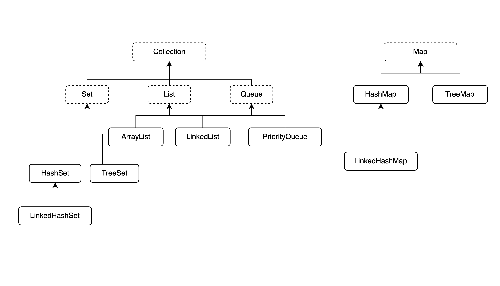

# 22장 자바랭 다음으로 많이 쓰는 애들은 컬렉션 - Part1(List)

자바에서 데이터를 담는 자료 구조는 크게 다음과 같이 분류할 수 있다.

- 순서가 있는 목록(List) 형
- 순서가 중요하지 않은 셋(Set) 형
- 먼저 들어온 것이 먼저 나가는 큐(Queue) 형
- key-value로 저장되는 맵(Map) 형

자바에서 List, Set, Queue는 Collection이라는 인터페이스를 구현하고 있다.
Collection 인터페이스는 java.util 패키지에 선언되어 있다.

다음은 자바의 컬렉션과 관련된 클래스들의 관계를 보여준다.



## Collection 인터페이스

Collection 인터페이스에 대해 알아보자

```
public interface Collection<E> extends Iterable<E>
```

Collection 인터페이스가 Iterable 인터페이스를 확장했기에, Iterator 인터페이스를 사용하여 데이터를 순차적으로 가져올 수 있다.

다음은 Collection 인터페이스에 선언된 주요 메소드들이다. List, Set, Queue는 아래 메소드를 상속받았으니 헷갈리지 말자.

- add(E e)
- addAll(Collection)
- clear()
- contains(Object)
- containsAll(Collection)
- equals(Object)
- hashCode()
- isEmpty()
- iterator()
- remove(Object)
- removeAll(Collection)
- retainAll(Collection)
- size()
- toArray()
- toArray(T[])

## List 인터페이스

List 인터페이스는 배열처럼 '순서'가 있다. 다음은 List 인터페이스를 구현한 클래스다.

- ArrayList: 확장 가능한 배열(thread safe하지 않다)
- Vector: 확장 가능한 배열(thread safe하다)
- Stack: Vector 클래스를 확장하여 만들었다.
- LinkedList: List에도 속하지만 Queue에도 속한다.

## ArrayList

다음은 ArrayList의 상속 관계다.

```
java.lang.Object
    ㄴ java.util.AbstractCollection<E>
        ㄴ java.util.AbstractList<E>
            ㄴ java.util.ArrayList<E>
```

ArrayList가 구현한 모든 인터페이스는 다음과 같다.

- Serializable: 원격으로 객체를 전송하거나, 파일에 저장할 수 있음을 지정
- Cloneable: Object 클래스의 clone() 메소드가 수행될 수 있음을 지정(복제 가능한 객체)
- Iterable<E>: 객체가 'foreach'를 사용할 수 있음을 지정
- Collection<E>: 여러 객체를 하나의 객체에 담아 처리할 때의 메소드 지정
- List<E>: 목록형 데이터를 처리하는 것과 관련된 메소드 지정
- RandomAccess: 목록형 데이터에 보다 빠르게 접근할 수 있도록 임의로 접근하는 알고리즘이 적용된다는 것을 지정

### ArrayList의 생성자

- ArrayList(): 객체를 저장할 공간이 10개인 ArrayList를 만든다.
- ArrayList(Collection<? extends E> c): 매개 변수로 넘어온 컬렉션 객체가 저장되어 있는 ArrayList를 만든다.
- ArrayList(int initialCapacity): 매개변수로 넘어온 initialCapacity 개수만큼의 저장공간을 갖는 ArrayList를 만든다.

```java
public class ListSample {
    public static void main(String[] args) {
        ArrayList<String> list1 = new ArrayList<>();
    }
}
```

### ArrayList에 데이터 담기

- add(E e)
- add(int index E e)
- addAll(Collection<? extends E> c)
- addAll(int index, Collection<? extends E> c)

Shallow copy와 Deep copy

### ArrayList에서 데이터 꺼내기

- size()
- get(int index)
- indexOf(Object o)
- lastIndexOf(Object o)
- toArray(): 리턴이 Object[]임으로 아래 메소드를 이용하여 크기가 0인 배열을 매개 변수로 넘겨주는 것이 좋다.
- toArray(T[] a)

### ArrayList에 있는 데이터 삭제하기

- clear()
- remove(int index)
- remove(Object o)
- removeAll(Collection<?> c)

### ArrayList 값 변경

- set(int index, E element)

## Stack 클래스

LIFO 기능을 구현하려고 할 때 필요한 클래스다.

사실 Stack 클래스보다 빠른 ArrayDeque라는 클래스가 존재하지만, 이는 thread safe하지 않기 때문에 상황에 맞는 자료구조를 사용해야 한다.

다음은 Stack 클래스의 상속 관계다.

```
java.lang.Object
    ㄴ java.util.AbstractCollection<E>
        ㄴ java.util.AbstractList<E>
            ㄴ java.util.Vector<E>
                ㄴ java.util.Stack<E>
```

스택은 Vector 클래스를 상속하고 있어 Vector의 모든 메소드를 사용할 수 있다.

다음은 스택의 생성자다.

- Stack()

다음은 스택의 메소드다.

- empty()
- peek()
- pop()
- push(E item)
- search(Object o)
