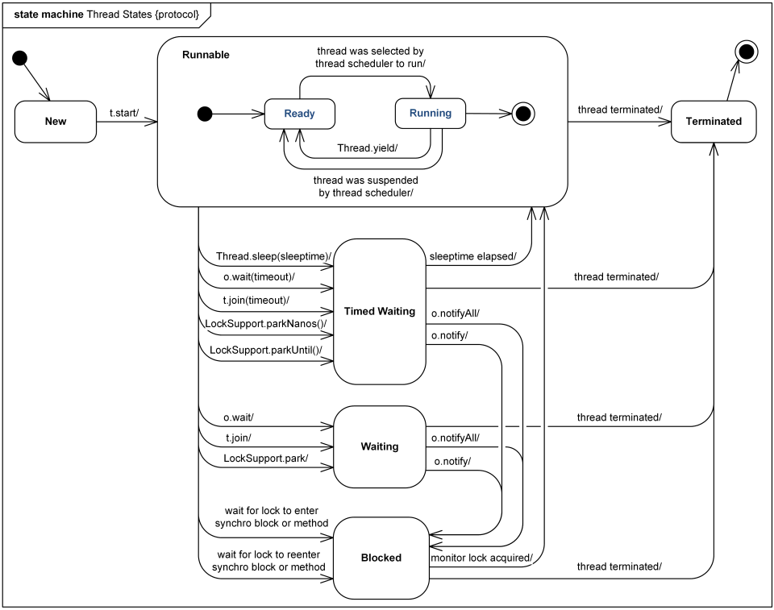

# 25장 쓰레드는 개발자라면 알아두는 것이 좋아요

java 명령어를 사용하여 클래스를 실행시키는 순간 자바 프로세스가 시작되고, main() 메소드가 수행도면서 하나의 스레드가 시작된다.
여러 스레드가 필요하다면, main 메소드에서 스레드를 생성해주면 된다.
Tomcat과 같은 WAS(Web Application Server)도 main() 메소드에서 생성한 스레드들이 수행되는 것이다.

실행 중인 스레드가 존재한다면 애플리케이션은 종료되지 않는다(데몬 스레드는 제외).

## Runnable 인터페이스와 Thread 클래스

다음은 스레드를 생성하는 두 가지 방법이다.

1. Runnable 인터페이스
2. Thread 클래스

자바는 다중 상속을 지원하지 않기 때문에, 스레드로 사용되어야 할 클래스가 다른 클래스를 이미 상속하고 있다면 Runnable 인터페이스를 사용해야 한다.

- Runnable을 구현한 클래스

```java
public class RunnableSample implements Runnable{
    @Override
    public void run() {
        System.out.println("This is RunnableSample's method.");
    }
}
```

- Thread를 상속한 클래스

```java
public class ThreadSample extends Thread {
    @Override
    public void run() {
        System.out.println("This is ThreadSample's Method");
    }
}
```

- 다중 스레드를 생성하고 실행하기

```java
public class RunThreads {
    public static void main(String[] args) {
        RunnableSample runnable = new RunnableSample();
        new Thread(runnable).start();

        ThreadSample thread = new ThreadSample();
        thread.start();

        System.out.println("RunThread is ended");
    }
}
```

Runnable 인터페이스는 run() 메소드만 선언되어있다.

run() 메소드를 스레드의 시작점으로 작성해야 한다. 스레드의 start() 메소드를 실행하면, 자바는 run() 메소드를 실행하게 되어있다.

스레드를 구현하고 start() 메소드를 호출하면, **run() 메소드의 내용의 종료되지 않더라도 스레드를 시작한 메소드에서는 그 다음 줄에 있는 코드를 실행한다.**

## Thread 클래스의 생성자

다음은 Thread 클래스의 생성자다.

- Thread()
- Thread(Runnable target)
- Thread(Runnable target, String name)
- Thread(String name)
- Thread(ThreadGroup group, Runnable target, String name)
- Thread(ThreadGroup group, Runnable target, String name, long stackSize)
- Thread(ThreadGroup group, String name)

다음은 생성자의 매개 변수에 대한 설명이다.

- name: 모든 스레드는 이름이 있다(기본 값: Thread-n)
- ThreadGroup: 스레드 그룹
- stackSize: 스레드의 스택의 크기

## Thread 클래스의 주요 메소드

- run(): start() 메소드를 호출하면 실행될 메소드
- getId(): JVM에서 생성한 고유 id를 리턴
- getName(): 스레드 이름 리턴
- setName(String name): 스레드 이름 설정
- getPriority(): 스레드 우선 순위 확인
- setPriority(int newPriority): 스레드 우선 순위 지정
- isDaemon(): 스레드가 데몬인지 확인
- setDaemon(boolean on): 스레드 데몬 설정
- getStackTrace(): 스레드의 스택 정보 확인
- getState(): 스레드의 상태 확인
- getThreadGroup(): 스레드의 그룹 확인

스레드는 우선 순위와 관계 있는 3개의 상수가 있다.

- MAX_PRIORITY: 10
- NORM_PRIORITY: 5
- MIN_PRIORITY: 1

우선 순위를 정할 일이 있다면 상수를 이용하는 것을 권장한다. 하지만, 우선 순위는 되도록이면 지정하지 않는 것이 좋다.

## Daemon Thread

> 멀티태스킹 운영 체제에서 데몬(daemon, 발음: 데이먼/'deɪmən/ 또는 디먼 /'dimən/[1])은 사용자가 직접적으로 제어하지 않고, 백그라운드에서 돌면서 여러 작업을 하는 프로그램을 말한다.
>
> 출처: 위키피디아

데몬 스레드는 background에서 실행되는 낮은 우선 순위를 가진 스레드다. 사용자 스레드는 해당 스레드가 종료될 때까지 JVM이 기다려주지만, 데몬 스레드는 사용자 스레드가 모두 종료되면 자동으로 종료된다. 가비지 컬렉터는 대표적인 데몬 스레드다.

다음은 예제를 보며 데몬스레드를 만들어보자.

- Long.MAX_VALUE만큼 sleep 하는 스레드 만들기

```java
public class DaemonThread extends Thread {
    public void run() {
        try {
            Thread.sleep(Long.MAX_VALUE);
        } catch (InterruptedException e) {
            e.printStackTrace();
        }
    }
}

```

- 만든 스레드를 데몬 스레드로 설정하기

```java
public class RunDaemonThread {
    public static void main(String[] args) {
        DaemonThread daemonThread = new DaemonThread();
        daemonThread.setDaemon(true);
        daemonThread.start();
    }
}
```

만약 위에서 만든 스레드가 데몬 스레드가 아니였다면, 프로세스는 매우 오랜 시간동안 종료되지 않았을 것이다. 하지만 setDaemon() 메소드로 데몬 스레드로 설정했기 때문에, 해당 스레드가 종료되지 않더라도 프로세스는 종료된다.

## synchronized

다중 스레드가 thread safe 하지 않은 자원에 접근하거나, 수정하려고 하면 race condition이 발생하여 의도하지 않은 결과가 발생할 수 있다. 자바의 synchronized 키워드는 특정 메소드나, 블럭을 임계 구역으로 만들어 동시성을 보장한다.

synchronized 키워드를 사용하는 방법은 총 두 가지다.

1. 메소드 자체를 synchronized로 선언하는 방법
2. 메소드의 특정 문장만 synchronized statements로 감싸는 방법

synchronzied 블록을 사용할 때는 lock이라는 별도의 객체를 사용할 수 있다. 그런데, 때에 따라서 이러한 객체는 하나의 클래스에서 두 개 이상 만들어 사용할 수도 있다.

```java
private int amount;
private int interest;
private Object interestLock = new Object();
private Object amountLock = new Object();

public void addInterest(int value) {
    synchronized(interestLock) {
        interest += value;
    }
}

public void addAmount(int value) {
    synchronized(amountLock) {
        amount += value;
    }
}
```

## 스레드를 통제하는 메소드들

다음은 스레드를 통제하는 메소드다.

- getState(): 스레드 상태 확인
- join(): 수행중인 스레드가 중지할 때까지 대기
- join(long millis): 매개 변수에 지정된 시간만큼 대기
- join(long mmillis, int nanos): 매개 변수에 지정된 시간만큼 대기 with nano
- interrupt(): 수행중인 스레드에 중지 요청(InterruptedException을 발생시킨다). 해당 메소드는 중지(blocked) 상태에서도 호출 가능

getState() 메소들르 호출하면 Thread.State이라는 enum 클래스를 리턴한다. 이 클래스에 선언되어 있는 상수들의 목록은 다음과 같다.

- NEW: 스레드 객체는 생성되었지만, 시작되지는 않은 상태
- RUNNABLE: 실행중인 상태
- BLOCKED: 실행 중지 상태이며, 모니터 락이 풀리기를 기다리는 상태
- WAITING: 스레드가 대기중인 상태
- TIMED_WAITING: 특정 시간만큼 스레드가 대기중인 상태
- TERMINATED: 스레드가 종료된 상태



- checkAccess(): 현재 수행중인 스레드가 해당 스레드를 수정할 수 있는 권한이 있는지 확인한다.
- isAlive(): 스레드가 살아 있는지 확인한다.
- isInterrupted(): run() 메소드가 정상적으로 종료되지 않고, interrupt() 메소드의 호출을 통해서 종료되었는지를 확인한다.
- interrupted(): 현재 스레드가 중지되었는지를 확인한다.

다음은 thread의 staic 메소드다.

- activeCount(): 현재 스레드가 속한 스레드 그룹의 스레드 중 살아 있는 스레드 개수를 리턴한다.
- currentThread(): 현재 수행중인 스레드의 객체를 리턴한다.
- dumpStack(): 콘솔 창에 현재 스레드의 스택 정보를 출력한다.

## Object 클래스에 선언된 스레드와 관련있는 메소드들

모든 클래스의 부모 클래스인 Object 클래스에서도 thread를 제어할 수 있는 메소드가 존재한다.

- wait(): 다른 스레드가 Object 객체에 대한 notify() 메소드나 notifyAll() 메소드를 호출할 때까지 현재 스레드가 대기하고 있도록 한다.
- wait(long timeout): wait과 동일하지만, 최대 대기 시간을 설정할 수 있다.
- wait(long timeout, int nanos): wait과 동일하지만, 최대 대기 시간을 설정할 수 있다(with nano)
- notify(): Object 객체의 모니터에 대기하고 있는 단일 스레드를 깨운다.
- notifyAll(): Object 객체의 모니터에 대기하고 있는 모든 스레드를 깨운다.

## ThreadGroup에서 제공하는 메소드들

ThreadGroup은 스레드 관리를 용이하기 위한 클래스다.

다음은 ThreadGroup 클래스에서 제공하는 주요 메소드다.

- activeCount(): 실행중인 스레드의 개수를 리턴한다.
- activeGroupCount(): 실행중인 스레드 그룹의 개수를 리턴한다.
- enumerate(Thread[] list): 현재 스레드 그룹에 있는 모든 스레드를 매개 변수로 넘어온 스레드 배열에 담는다.
- enumerate(Thread[] list, boolean recurse): 현재 스레드 그룹에 있는 모든 스레드를 매개 변수로 넘어온 스레드 배열에 담는다. 두 번째 매개 변수가 true면 하위에 있는 스레드 그룹에 있는 스레드 목록도 포함한다.
- enumerate(ThreadGroup[] list): 현재 스레드 그룹에 있는 모든 스레드 그룹을 매개 변수로 넘어온 스레드 그룹 배열에 담는다.
- enumerate(ThreadGroup[] list, boolean recurse): 현재 스레드 그룹에 있는 모든 스레드 그룹을 매개 변수로 넘어온 스레드 그룹 배열에 담는다. 두 번째 매개 변수가 true면 하위에 있는 스레드 그룹도 포함한다.
- getName(): 스레드 그룹의 이름을 리턴한다.
- getParent(): 부모 스레드 그룹을 리턴한다.
- list(): 스레드 그룹의 상세 정보를 출력한다.
- setDaemon(): 지금 스레드 그룹에 속한 모든 스레드들을 데몬으로 지정한다.
