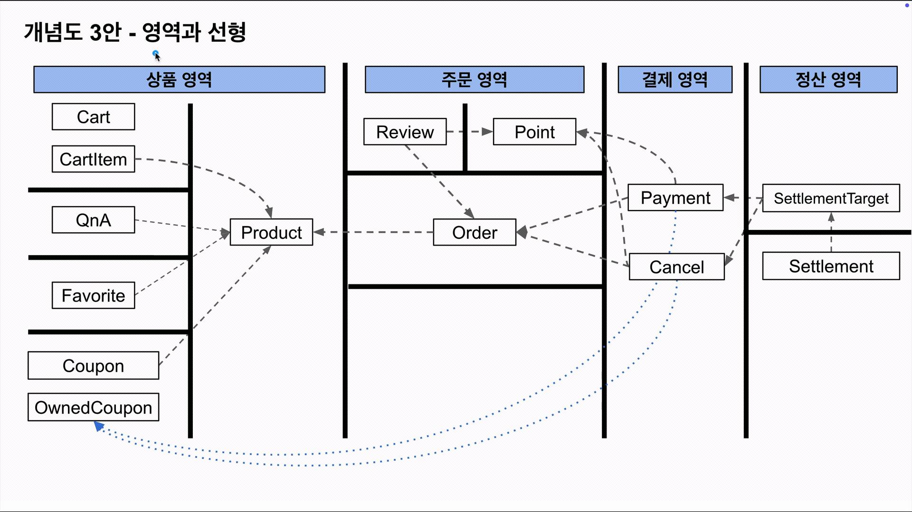

# 제미니의 개발실무 정리

## 1. 커뮤니케이션

### 기획자와의 소통

- 혼자 개발하고 결과만 내놓지 말고, **질문을 많이 하면서 요구사항을 명확히 이해**하자.
- 요구사항을 볼 때 두 가지 관점으로 접근한다:
    1. **비즈니스 관점** — 요구사항 자체에 대한 이해와 질문
    2. **기술 관점** — 클라이언트와 어떻게 데이터를 주고받을지 고민

### 회사 코드를 대하는 자세

- 회사에는 다양한 스타일의 코드가 존재하며, 모두 나름의 이유가 있다.
- 무조건 특정 아키텍처(예: 헥사고날)를 적용하려 하지 말고, 기존 코드가 왜 그렇게 작성되었는지 이해하려는 자세가 먼저다.

## 2. 개념도

더 자세히 알고 싶다면 참고: [지속 성장 가능한 설계를 만들어가는 방법 | 인프콘2024](https://youtu.be/HCB8jgAfG44?si=0GwV8PN4qKO4qI9j)

### 개념도란?

- **논리적인 지도**로, 소프트웨어에서 중요한 개념과 그 관계를 시각화한 것이다.
- 모든 클래스를 넣을 필요 없이, **핵심 개념만** 포함해야 한다.
    - 판단 기준: "이 개념을 모르면 기획자와 소통이 되는가?"

### 개념도의 구성 요소

- **개념**: 소프트웨어에서 중요한 단위. 클래스나 엔티티와 1:1 매핑하지 않는 것이 좋다. 굳이 매핑하자면 클래스에 더 가깝다(엔티티는 테이블을 투영하므로).
- **격벽**: 개념 간 무분별한 참조를 막기 위한 경계.

### 개념도 활용

- 의존성 방향 파악 및 양방향 참조 방지
- 신규 입사자 온보딩 자료
- 다른 개발자·직군과의 소통 도구
- 도구: draw.io / 영역과 선형 구조로 그리면 읽기 편함

### 작성 팁

- User 같은 전역적 개념은 넣지 않는 편이 낫다 (개념도가 복잡해짐).
- 1차로 가볍게 작성 → 코드 작성 → 개념도 수정. 완벽히 그린 후 코드를 시작할 필요 없다.
- 개념도와 실제 코드는 밀접할 필요가 없다.

### 개념도 예시

## 3. 설계

### "정답은 없다"

- MAU, 테이블 row 수, 인프라, 인력 등 현재 상황에 따라 선택 기준이 달라진다.
- 강의에서 사용하는 레이어 규칙, 클래스 작명법, 로직도 정답이 아니다.
- **회사 컨벤션이 최우선**이며, 동료와의 합의가 중요하다.

### 제미니의 null에 대한 관점

- nullable은 모호함을 유발한다 — 언제 null이고 아닌지에 따라 클래스의 의미가 달라진다.
- 가급적 **개념 객체에서 null을 허용하지 않고, 클래스를 쪼개는 방향**을 선호.
- 단, 회사 룰이 있다면 그것을 우선한다.

### 엔티티와 도메인 객체 분리

- Entity는 테이블처럼 플랫하게, 도메인 객체는 구조화하여 분리하는 것을 선호.
- `@Embedded`로 Entity를 구조화할 수도 있지만, 분리하는 쪽을 추천.

## 4. API 설계

### API를 하나로 vs 쪼개서 만들기

- **하나의 통합 API**: UI 전용 API가 되기 쉬움. 기획이 변경되면 API를 새로 만들어야 함.
- **개념 단위로 쪼갠 API**: 특정 개념(예: 리뷰)의 스펙이 추가되어도 다른 API(예: 상품 조회)에 영향이 없음. **재사용성이 좋다.**
- 단, 이미 동작하는 하나의 API를 굳이 쪼갤 필요는 없다. 상황에 따라 판단.

### Response 클래스

- Response는 클라이언트 맞춤 필드다.
- 프론트의 구현 용이성을 위한 요청이라면, 내부 API가 다소 지저분해지더라도 열린 마음으로 받아들이자.

## 5. 도메인 설계 예시: 주문 vs 결제

### 개념 분리의 중요성

- **주문(Order)**: 내부 비즈니스의 중심축이 되는 개념.
- **결제(Payment)**: 외부(PG사 등)와 소통하며 외부 데이터를 직접 저장. 외부에 의존적.
- 두 개념이 가까우면 결제의 복잡도가 주문에 스며든다.

### 실무에서의 분리

- 규모 있는 회사에서는 주문팀과 결제팀을 분리한다.
- 결제팀도 다시 결제와 정산으로 분리한다.
- 외부 연동은 핸들링이 까다로우므로 **격리**시키는 것이 핵심.

## 6. 배치 처리

### 단계별 분리의 장점

거대한 데이터를 배치 처리할 때 한 번에 모든 단계를 실행하지 않고 나누면:

1. 임의의 데이터셋을 만들어 **테스트하기 쉽다**.
2. 특정 단계에서 문제가 발생했을 때 **해당 단계만 재처리**하면 된다.

## 출처

- [제미니의 개발실무 - 커머스 백엔드 기본편](https://www.inflearn.com/course/%EC%A0%9C%EB%AF%B8%EB%8B%88%EC%9D%98-%EA%B0%9C%EB%B0%9C%EC%8B%A4%EB%AC%B4-%EC%BB%A4%EB%A8%B8%EC%8A%A4-%EB%B0%B1%EC%97%94%EB%93%9C-%EA%B8%B0%EB%B3%B8/dashboard?cid=339108)