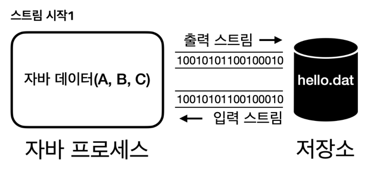
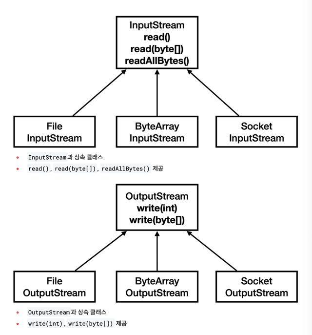

# InputStream, OutputStream

I/O는 파일, 네트워크, 메모리 등에 데이터를 읽고 쓰는 작업을 말한다.
자바는 추상 클래스 InputStream과 OutputStream을 제공해, 대상이 무엇이든(파일·네트워크·메모리 등) 일관된 방식으로 I/O를 처리할 수 있다.




예를 들어 파일에 데이터를 기록할 때는 FileOutputStream, 파일에서 데이터를 읽어올 때는 FileInputStream을 사용한다.

```java
import java.io.FileInputStream;
import java.io.FileOutputStream;

public static void main(String[] args) {
    // 외부 자원을 사용한 후 반드시 자원을 닫아줘야 하는데, try-with-resources가 유용하다.
    try (FileOutputStream fos = new FileOutputStream("temp/hello.dat")) {
        // 바이트 단위로 쓴다.
        fos.write(65);
        fos.write(66);
        fos.write(67);
    }

    try (FileInputStream fis = new FileInputStream("temp/hello.dat")) {
        // 바이트 단위로 읽는다.
        System.out.println(fis.read()); // 65
        System.out.println(fis.read()); // 66
        System.out.println(fis.read()); // 67
        System.out.println(fis.read()); // -1(EOF)
    }
}
```

FileInputStream이 파일 끝에 도달하면 -1을 반환한다는 점을 이용해 아래와 같이 데이터를 읽을 수 있다.

```java
import java.io.FileInputStream;
import java.io.FileOutputStream;

public static void main(String[] args) {
    // ... FileOutputStream 코드 생략

    try (FileInputStream fis = new FileInputStream("temp/hello.dat")) {
        int data;
        while ((data = fis.read()) != -1) {
            System.out.println(data);
        }
    }
}
```

read(), write() 메서드를 호출하면 OS의 시스템 콜을 통해 파일을 읽거나 쓰는 명령어를 전달하는데 이는 무거운 작업이다.
1바이트 단위로 데이터를 읽고 쓸 경우 시스템 콜이 자주 발생하고 성능상 좋지 않기에 byte[] 단위로 데이터를 읽고 쓰는 것이 좋다.

```java
import java.io.FileInputStream;
import java.util.Arrays;

public static void main(String[] args) {
    try (final FileOutputStream fos = new FileOutputStream("temp/hello.dat")) {
        byte[] input = {65, 66, 67};
        fos.write(input); // 한 번의 시스템 콜만 발생한다.
    }

    try (FileInputStream fis = new FileInputStream("temp/hello.dat")) {
        final byte[] buffer = new byte[10];
        final int readCount = fis.read(buffer, 0, 10);
        System.out.println("readCount = " + readCount);
        System.out.println("buffer = " + Arrays.toString(buffer));
    }
}
```

모든 데이터를 한 번에 읽으려면 FileInputStream#readAllBytes()를 호출한다.
다만 파일이 클 경우 OOM이 발생할 수 있기에 버퍼를 사용하여 쪼개서 읽는 것이 낫다.

## 파일 입출력과 성능 최적화(버퍼)

다음은 버퍼 없이 10MB 크기의 파일을 만들고, 읽는 예제다.

```java
import java.io.FileInputStream;
import java.io.FileOutputStream;

public static void main(String[] args) {
    final String FILE_NAME = "temp/data.dat";
    final int FILE_SIZE = 10 * 1024 * 1024; // 10MB

    // 쓰기
    try (FileOutputStream fos = new FileOutputStream(FILE_NAME)) {
        for (int i = 0; i < FILE_SIZE; i++) {
            fos.write(1);
        }
    }

    // 읽기
    int readSize;
    try (FileInputStream fis = new FileInputStream(FILE_NAME)) {
        while ((data = fis.read()) != -1) {
           readSize++;
        }
    }
    System.out.println("readSize = " + readSize);
}
```

위 코드는 1바이트씩 읽고 쓰기 때문에 약 2천만번의 시스템 콜이 발생한다.
이를 버퍼를 사용하면 한번에 8kb씩 읽고 쓰기에 실행 속도가 매우 빨라진다.

```java
import java.io.FileInputStream;
import java.io.FileOutputStream;

public static void main(String[] args) {
    final String FILE_NAME = "temp/data.dat";
    final int FILE_SIZE = 10 * 1024 * 1024; // 10MB
    final int BUFFER_SIZE = 8 * 1024; // 8KB

    // 쓰기
    try (FileOutputStream fos = new FileOutputStream(FILE_NAME)) {
        final byte[] buffer = new byte[BUFFER_SIZE];
        int bufferIndex = 0;

        for (int i = 0; i < FILE_SIZE; i++) {
            buffer[bufferIndex++] = 1;
            if (bufferIndex == BUFFER_SIZE) {
                fos.write(buffer);
                bufferIndex = 0;
            }
        }
        if (bufferIndex > 0) {
            fos.write(buffer, 0, bufferIndex);
        }

        // 읽기
        int readTotalSize;
        try (FileInputStream fis = new FileInputStream(FILE_NAME)) {
            int readSize;
            while ((readSize = fis.read(buffer)) != -1) {
                readTotalSize += readSize;
            }
        }
        System.out.println("readTotalSize = " + readTotalSize);
    }
}
```

버퍼의 크기는 4kb ~ 8kb이 적당한데 이는 디스크나 파일 시스템에서 데이터를 읽고 쓰는 기본 단위가 4kb 또는 8kb기 때문이다.
이것보다 많은 데이터를 버퍼에 남아서 보내도 디스크나 파일 시스템에서 4~8kb로 나누어 저장하기에 효율에는 한계가 있다.

## BufferedOutputStream, BufferedInputStream

BufferedOutputStream, BufferedInputStream을 사용하면 버퍼 기능을 내부에서 대신 처리해준다.

```java
import java.io.BufferedInputStream;
import java.io.BufferedOutputStream;
import java.io.FileInputStream;
import java.io.FileOutputStream;

public static void main(String[] args) {
    final String FILE_NAME = "temp/data.dat";
    final int FILE_SIZE = 10 * 1024 * 1024; // 10MB

    // 쓰기
    try (BufferedOutputStream bos = new BufferedOutputStream(new FileOutputStream(FILE_NAME))) {
        for (int i = 0; i < FILE_SIZE; i++) {
            bos.write(1);
        }
    }

    // 읽기
    int readTotalSize;
    try (BufferedInputStream bis = new BufferedInputStream(new FileInputStream(FILE_NAME))) {
        while ((readSize = bis.read()) != -1) {
            readTotalSize += readSize;
        }
    }
    System.out.println("readTotalSize = " + readTotalSize);
}
```

각 버퍼 스트림의 내부 동작은 다음과 같다.

- BufferedOutputStream:
  - 내부에 `byte[] buf`라는 버퍼를 갖는다.
  - write(int)가 호출되면 데이터를 내부 버퍼에 저장한다.
  - 버퍼가 가득차면 FileOutputStream에 있는 write(byte[])를 호출하여 버퍼의 데이터를 쓴다.
  - 버퍼를 비운다.
  - close()를 호출하면 내부적으로 flush()를 호출하여 버퍼에 남아 있는 데이터를 쓴다.
  - close()를 호출하면 내부의 FileOutputStream도 close()를 호출한다.
- BufferedInputStream:
  - 마찬가지로 내부 버퍼를 갖는다.
  - read() 호출 시 내부 버퍼에 데이터가 없으면 FileInputStream.read(byte[])를 호출하여 버퍼를 채운다.
  - 버퍼에 있는 데이터 중 1byte를 반환한다.
  - read()를 또 호출하면 버퍼에서 1byte를 반환한다.

BufferedOutputStream의 내부 동작은 다음과 같다.

1. 내부에 `byte[] buf`라는 버퍼를 갖고 있음
2. write(int)를 호출해 byte 하나를 전달하면 내부 버퍼에 보관됨
3. 버퍼가 가득차면 FileOutputStream에 있는 write(byte[]) 메서드를 호출하여 전달된 모든 byte[]를 시스템 콜로 OS에 전달함.
4. 버퍼의 내용을 비움
5. 버퍼가 다 차지 않아도 버퍼에 남이 있는 데이터를 전달하려면 flush()를 호출하면 됨.
6. 버퍼에 데이터가 남아 있는 상태로 close()를 호출하면 내부에서 flush()를 호출함.
7. close()를 호출하면 내부의 FileOutputStream의 자원도 정리됨.
8. 스트림을 연결해서 사용한 경우 마지막에 연결한 스트렘을 반드시 닫아줘야 함.

> 참고:
>
> - 기본 스트림: FileOutputStream과 같이 단독으로 사용할 수 있는 스트림
> - 보조 스트림: BufferedOutputStream과 같이 단독으로 사용할 수 없고, 보조 기능을 제공하는 스트림

## 출처

- [김영한의 실전 자바 고급 2](https://www.inflearn.com/course/%EA%B9%80%EC%98%81%ED%95%9C%EC%9D%98-%EC%8B%A4%EC%A0%84-%EC%9E%90%EB%B0%94-%EA%B3%A0%EA%B8%89-2)
