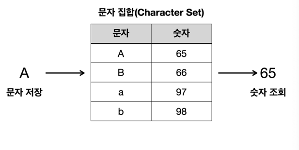

# 문자 인코딩

## 컴퓨터와 데이터

컴퓨터의 메모리는 트랜지스터라고 불리는 전자 스위치로 구성되어 있다.
각 트랜지스터는 전기가 흐르거나 흐르지 않는 두 가지 상태를 가질 수 있어서, 이를 통해 0과 1이라는 이진수를 표현한다.
따라서 컴퓨터는 이진수로 데이터를 저장할 수 있다. 이때 한개의 트랜지스터가 표현할 수 있는 단위(켜짐/꺼짐)를 1비트(bit)라고 한다.
비트가 한 개 커질 떄마다 표현할 수 있는 개수는 두 배가 된다.

## 컴퓨터와 문자 인코딩

이 문서를 구성하고 있는 문자도 사실 전부 0과 1로 저장된 데이터다.
컴퓨터는 문자와 숫자를 매핑한 '문자 집합(character set)'을 사용하여 문자를 인코딩/디코딩한다.
여기서 인코딩이란 문자를 이진수로 변환하는 것이고, 디코딩은 이진수를 문자로 변환하는 과정이다.



문자 집합의 종류는 다음과 같다.

- ASCII:
  - 개발년도: 1960년도
  - 크기: 7비트
  - 특징: 대소문자, 숫자, 몇몇 특수문자를 포함한다.
- ISO_8859_1:
  - 개발년도: 1980년도
  - 크기: 8비트(ASCII + 1비트)
  - 특징:
    - 서유럽을 중심으로 컴퓨터 사용 인구가 증가하여, 서유럽 문자를 표현하는 문자 집합 필요.
    - ASCII에 128가지 문자를 추가했다(주로 서유럽 문자, 추가 특수 문자)
    - 기존 ASCII 문자 집합과 호환 가능
- EUC-KR
  - 개발년도: 1980년도
  - 크기: 영어 1바이트, 한글 2바이트
  - 특징:
    - 초창기 한글 문자 집합
    - 자주 사용하는 한글 2350개 + 한자 같이 한글에서 자주 사용하는 기타 글자 포함
    - 기존 ASCII 문자 집합과 호환 가능
- MS949
  - 개발년도: 1990년도
  - 크기: 영어 1바이트, 한글 2바이트
  - 특징:
    - 마이크로소프트가 EUC-KR을 확장하여 만듦
    - 모든 한글(11,172자)를 표현할 수 있음.
    - 기존 ASCII 문자 집합과 호환 가능
- 유니코드:
  - 세상의 모든 문자, 심지어 이모지까지 표현하기 위해 개발된 문자 집합이다. 대표적으로 UTF-8과 UTF-16이 있다.
  - UTF-16
    - 개발년도: 1990년도
    - 크기: 2바이트 기반
      - 2바이트: 영어, 유럽 언어, 한국어, 중국어, 일본어 같은 메인 문자
      - 4바이트: 고대 문자, 이모지 등
    - 특징:
      - 대부분의 문자를 2바이트로 처리하기에 계산이 편리함
      - 초기에는 UTF-16이 인기였고, 자바도 이를 사용함. 그래서 자바의 char 타입은 2byte.
      - ASCII와 호환되지 않는다.
  - UTF-8
    - 개발년도: 1990년도
    - 크기: 1~4byte
      - 1byte: ASCII, 영문, 기본 라틴 문자
      - 2byte: 그리스어, 히브리어 라틴 확장 문자
      - 3byte: 한글, 한자, 일본어
      - 4byte: 이모지, 고대 문자
    - 특징:
      - UTF-16에 비해 각 문자가 가변 길이로 인코딩되므로 문자열의 특정 문자에 접근하거나, 문자 수를 세는 작업이 상대적으로 복잡함.
      - 기존 ASCII 문자 집합과 호환 가능
      - 현대의 표준 인코딩 기술:
        - 웹 문서의 80%는 영어로 작성.
        - 한 글자에 2바이트인 UTF-16보다 UTF-8을 사용하는 것이 이득.
        - ASCII와 호환되는 것도 이점

## 문자 집합 조회

`Charset`과 `StandardCharsets`를 이용해서 문자 집합을 조회할 수 있다.

```java
public static void main(String[] args) {
    // 이용 가능한 모든 Charset 자바 + OS
    final SortedMap<String, Charset> charsets = Charset.availableCharsets();
    for (String charsetName : charsets.keySet()) {
        System.out.println("charsetName = " + charsetName);
    }

    // 문자로 조회
    final Charset ms949 = Charset.forName("MS949");
    System.out.println("ms949 = " + ms949);

    // 별칭(alias) 조회
    final Set<String> aliases = ms949.aliases();
    for (String alias : aliases) {
        System.out.println("alias = " + alias);
    }

    // 상수로 조회(자주 사용되는 문자 집합이 정의되어 있음)
    final Charset utf8 = StandardCharsets.UTF_8;
    System.out.println("utf8 = " + utf8);

    // 시스템의 기본 Charset 조회
    final Charset defaultCharset = Charset.defaultCharset();
    System.out.println("defaultCharset = " + defaultCharset);
}
```

문자를 인코딩/디코딩할 때는 사용할 문자 집합을 넘겨줘야 한다.
호환되지 않는 문자 집합간의 인코딩 <-> 디코딩 시 올바른 값이 반환되지 않는다.

```java
public static void main(String[] args) {
    final String originalString = "A";
    final byte[] encoded = originalString.getBytes(StandardCharsets.UTF_8);
    final String decoded = new String(encoded, StandardCharsets.UTF_8);

    System.out.println(Arrays.toString(encoded)); // [65]
    System.out.println(decoded); // [A]

    final String wrongDecoded = new String(encoded, StandardCharsets.UTF_16);
    System.out.println(wrongDecoded); // � (디코딩 실패)
}
```

## 출처

- [김영한의 실전 자바 고급 2](https://www.inflearn.com/course/%EA%B9%80%EC%98%81%ED%95%9C%EC%9D%98-%EC%8B%A4%EC%A0%84-%EC%9E%90%EB%B0%94-%EA%B3%A0%EA%B8%89-2)
